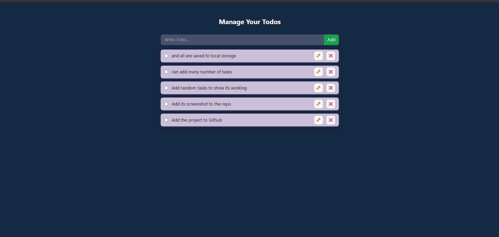

# To-Do-List

This project is a dynamic and responsive to-do list application built using React, Context API, local storage, HTML, and Tailwind CSS. The application allows users to create, update, and manage their tasks with ease. State management is handled through React's Context API, providing a seamless and efficient way to manage global state across components. Local storage is utilized to persist user data, ensuring that tasks remain intact even after the browser is closed or refreshed.

### Key Features:

<li> <b>React & Context API:</b> Manages the state of the to-do list efficiently across multiple components.</li>
<li> <b>Local Storage Integration:</b> Saves tasks locally, allowing for persistent data across sessions without relying on a backend.</li>
<li> <b>Responsive Design:</b> Tailwind CSS is used to create a clean, responsive UI that works across various devices.</li>
<li> <b>Task Management:</b> Users can add, update, delete, and toggle the completion status of tasks.</li>
<li> <b>User-Friendly Interface:</b> Simple and intuitive design that enhances user experience.</li>
